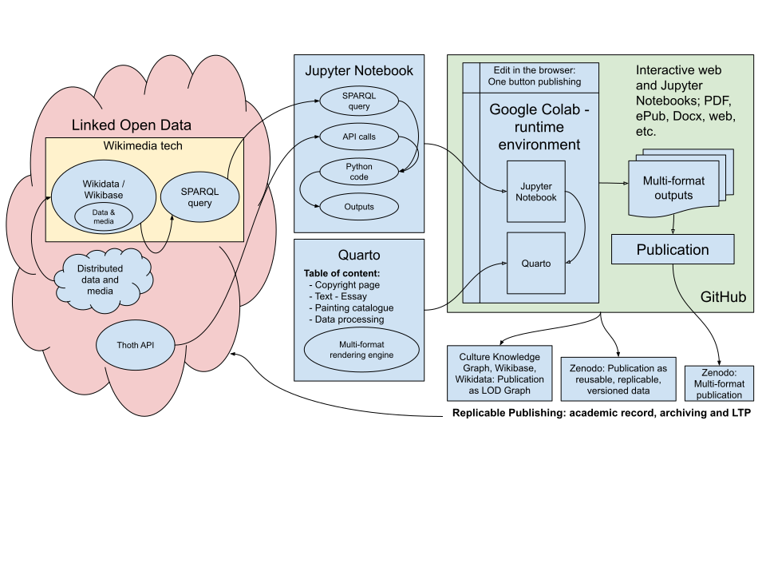

# Computational Publishing Service Demo

Codespace is GitHub's virtual machine service - with 60 hours and 15 GB per month on their free plan. With the link above you can run this demo in the browser. Codespaces are being used so that time consuming local installs are avoided. The Codespace instance is your own virtual machine from which you can push commits back to a repository and will maintain its state on closing. See your codespaces [here](https://github.com/codespaces) and read support docs [here](https://docs.github.com/en/codespaces).

The Codespace provided comes preconfigured for Jupyter Notebooks, Quarto, Python, and all the requirements needed.

## Codespace user instructions: 

Codespace provided a standard VSCode IDE app in the browser. As its a personal virtual VSCode IDE you can save work, and to push to Git you need to carry out usual Git workflows.

### Three step process

1. **Run Codespace** First time use: Select create new codespace. Second time use: Select resume codespace.
2. **Run Notebooks** First time running a Notebook you will be prompted to choose a Jupyter environment: Choose Python, select recommended. Once selected your runtime environment will save settings.
3. **Terminal: quarto preview, quarto render** Then the workflow is the standard workflow; Run Notebooks; save Notebooks; run Quarto commands in the Terminal - quarto help, quarto check, quarto preview, quarto render; then carry out any Git workflow as needed.

Note: Codespaces are persistent and the last saved state will be present on resume.

To close or start Codespaces. Close Codespace from the far bottom left Codespace panel - you will be given options in the command menu top, for stopping. To start Codespace go to the repo button or visit to start and stop any Codespace you have: https://github.com/codespaces

---

[Project issues](https://github.com/orgs/NFDI4Culture/projects/1/views/4) | [Wiki - Work plan](https://github.com/NFDI4Culture/CPS-Demo/wiki/Work-plan-and-existing-R&D)

## Prototype: Exhibition catalogue publication

Simon Worthington, [simon.worthington@tib.eu](mailto:simon.worthington@tib.eu), NFDI4Culture. Open Science Lab, TIB. 03.2024

Demo and code: [https://github.com/NFDI4Culture/CPS-Demo](https://github.com/NFDI4Culture/CPS-Demo)

## The service

Computational Publishing Service (CPS) uses Jupyter Notebooks to publish from cultural digital collections using Linked Open Data, and Wikidata and Wikibase. The service is designed to sit on top of existing NFDI4Culture Linked Open Data infrastructure.

Use cases: Digital Humanities scholars, cultural digital collections, and humanities publishing.

Value proposition: Provide a channel to audiences for cultural digital collections, enable reusable machine readable record of content used in publications, allow humanities publishers to integrate and support computational publications.

## The prototype

The goal is to demonstrate automated multi-format publishing – web, PDF, ePub Docx, and  interactive Jupyter Notebooks – of content from digital cultural collections stored as Linked Open Data (LOD) on Wikidata and Wikibase, and from other APIs and LOD sources.

The Jupyter Notebooks will be used in a virtual online environment 'Github Codespace' so that there are __zero-install__ overheads as a barrier for users.

The publications will be authored using Jupyter Notebooks used via the Google Colab platform, from GitHub storage, and rendered to multi-format using the Jupyter Notebook wrapper platform Quarto. The publication will be published to GitHub.

The content of the demo will be a fictional exhibition catalogue of a collection of paintings from the Corpus of Baroque Ceiling Painting in Germany (CbDD).

[Link to drawing](https://docs.google.com/drawings/d/1YOS5C4GYxoWCXuSEN1039IjGtbEpYJRa1vXCraEugts/edit?usp=sharing) on Google Drive (commenting view)

## Software Citation

Worthington, S., & Bowie, S. (2024). Computational Publishing Service Demo (Version 0.0.1a) [Computer software]. https://github.com/NFDI4Culture/CPS-Demo

Add your name and ORCID in the CITATION.cff file to be attributed for your code contributions. Make a pull request after editing.

Edit Citation File Format: [CITATION.cff](CITATION.cff)

About Citation File Format: https://citation-file-format.github.io/

## Licensing

License: MIT License http://www.apache.org/licenses/

License information: [LICENSE](LICENSE)

 This work is licensed under a <a rel="license" href="http://creativecommons.org/licenses/by-sa/4.0/">Creative Commons Attribution-ShareAlike 4.0 International License</a>.
